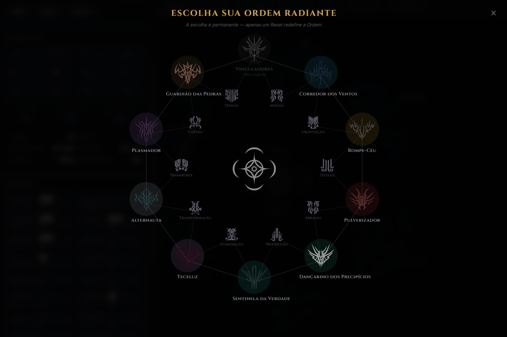

Cosmere RPG - Árvore de Habilidades e Gerador de Fichas

Um aplicativo web interativo desenvolvido para facilitar a criação e o gerenciamento de personagens no sistema Cosmere RPG. A ferramenta oferece uma interface visual rica, incluindo uma visualização em 3D das árvores de habilidades, seleção de Ordens Radiantes e a capacidade de exportar sua ficha de personagem diretamente para PDF.

Link para o projeto: https://pretetis.github.io/Cosmere-Builder/

🌟 Funcionalidades

    Árvore de Habilidades 3D: Navegue pelas habilidades e caminhos (Heroic Paths) do seu personagem em um ambiente interativo gerado com Three.js.

    Gerenciamento de Personagem: Controle de nível, patamar (tier), atributos, defesas e perícias de forma automatizada.

    Roda Radiante (Radiant Wheel): Interface dedicada para a escolha da sua Ordem Radiante.

    Salvar múltiplos personagens no cache do navegador: armazene até 20 personagens localmente via localStorage.

    Importação de PDF: carregue uma ficha a partir do PDF exportado pelo sistema, sem depender de JSON.

    Exportação para PDF: gere a ficha do seu personagem pronta para impressão ou uso digital.

🛠️ Tecnologias Utilizadas

    Front-end: HTML5, CSS3, JavaScript (Vanilla).

    Renderização 3D: Three.js (via CDN).

    Geração de PDF: pdf-lib para preenchimento e exportação da ficha.

    Servidor Local: Python (http.server).

 
    
🚀 Tutorial de Instalação e Execução

Como o projeto faz uso de módulos Node (para a biblioteca de PDF) e requer um servidor local para carregar os arquivos JSON e os modelos 3D corretamente devido às políticas de CORS dos navegadores, siga os passos abaixo:
Pré-requisitos

Antes de começar, você precisará ter instalado em sua máquina:

    Node.js e npm: Necessários para instalar as dependências locais (como o pdf-lib).

    Python: Necessário para rodar o script de servidor local de forma rápida.

Passo a Passo

1. Clone o repositório ou extraia os arquivos
Abra o terminal na pasta onde deseja instalar o projeto e garanta que todos os arquivos (incluindo index.html, package.json e start.bat) estejam lá.

2. Instale as dependências
No terminal, dentro da pasta raiz do projeto, execute o seguinte comando para instalar o pdf-lib contido no package.json:

npm install

3. Inicie o servidor local
Para contornar o bloqueio de CORS ao carregar os dados JSON e as texturas/SVGs, você precisa rodar o projeto através de um servidor local.

    No Windows: Basta dar um duplo clique no arquivo start.bat. Isso iniciará o servidor local na porta 8081. O script utiliza o comando python -m http.server 8081.

    Em outros sistemas (ou manualmente): Abra o terminal na pasta do projeto e digite:

python -m http.server 8081

4. Acesse o aplicativo
Abra o seu navegador de preferência e acesse o endereço:
http://localhost:8081

📂 Estrutura de Diretórios (Resumo)

    /css: Folhas de estilo (ex: style.css).

    /js: Scripts lógicos do aplicativo (app.js, data.js, renderer.js).

    /data: Arquivos JSON contendo os dados do sistema (perícias, caminhos radiantes, etc).

    /svg e /sheets: Recursos visuais e o arquivo PDF base da ficha (br_sheet.pdf).

    index.html: A página principal da aplicação.

    start.bat: Script de inicialização rápida para Windows.

Desenvolido por Pretetis.
